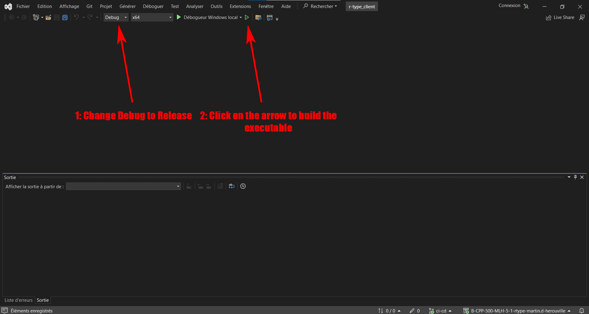

<div align="center">
    <h1 align="center">
        Installation
    </h1>
</div>

## Description

Building a game like R-Type from its source code is a complex process that requires specific configuration and steps. Here's a brief description of the general steps to build the R-Type game from its source code:

### Step 1: Prerequisites

Before you begin, ensure that you have all the necessary prerequisites installed on your system. This may include:

- A C/C++ development environment (such as g++ for Linux or Visual Studio for Windows).
- [CMake](https://cmake.org/).
- RPM package for Linux.
- The necessary low-level and platform-specific graphical or sound system libraries such as [OpenGL](https://www.opengl.org/) and X11, and some other libraries used by SFML: (If you are on Windows, Ubuntu or Fedora, all these libraries are already included in the project)
    -   [OpenAL-Soft](https://github.com/kcat/openal-soft)
    -   [stb_image and stb_image_write](https://github.com/nothings/stb)
    -   [freetype](https://gitlab.freedesktop.org/freetype/freetype)
    -   [libogg](https://gitlab.xiph.org/xiph/ogg)
    -   [libvorbis](https://gitlab.xiph.org/xiph/vorbis)
    -   [libflac](https://gitlab.xiph.org/xiph/flac)
    -   [minimp3](https://github.com/lieff/minimp3)

### Step 2: Download the Source Code

Make sure you have access to the R-Type game's source code. You can typically download it from a Git repository using the command:

```bash
git clone git@github.com:EpitechPromo2026/B-CPP-500-MLH-5-1-rtype-martin.d-herouville.git
cd B-CPP-500-MLH-5-1-rtype-martin.d-herouville
git submodule update --init --recursive
```

These commands will get all the source code from the game and init all the necessary dependencies for the good of the project.

### Step 3: Build Configuration

To build the different build tools we have scripts who make the job.

#### On Linux
If you are on linux, run this command:

```bash
./build_project.sh
```

It create the necessary files in the `build` folder in both `client` and `server`.

To run the server and the client on Linux, I will redirect you to the [Usage](./README.md#usage) section in the README.

#### On Windows

If you are on Windows, you have two options:

- Use the `msbuild` command line tool to build the project.
- Use the Visual Studio IDE to build the project.

In both cases, you can use the following command:

```bash
.\build_project.ps1
```

If you don't have the `msbuild` command line tool installed and configured, the script will open the Visual Studio IDE for the client and the server. Otherwise, you have nothing to do, the script will build the project for you.

Visual Studio will open like this: You just have to follow the instructions on the screen.



> Be aware that you have to build both the client and the server.

It creates the necessary files in the `build` folder in `client` and `server`.

To run the server and the client on Windows, I will redirect you to the [usage](./README.md#usage) section in the README.
