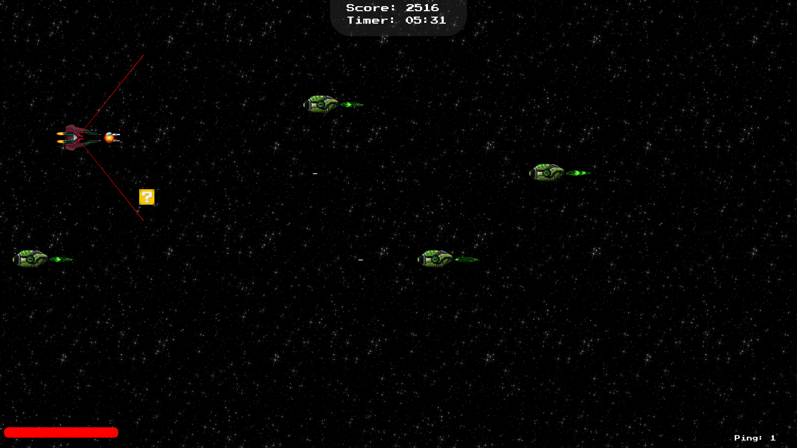

<div align="center">
    <h1 align="center">
        RType
    </h1>
</div>

## Description

RType is a 2D game based on the original R-Type game. It is a side-scrolling shoot'em up in which the player controls a spaceship to fight against enemies. The player can move the spaceship in two directions, shoot and use a special attack. The goal is to reach the end of the level by destroying all enemies.

This repository contains the client and server of the game. The client is the game itself where the user controls his player, and the server is used to manage the game sessions and the players.

## Install from release

The game is currently available on Ubuntu, Fedora and Windows.

You can download the latest release of the game [here](https://github.com/EpitechPromo2026/B-CPP-500-MLH-5-1-rtype-martin.d-herouville/releases).

- On windows, pick the file named `r-type_client-v1.0.0-win64-installer.exe` and `r-type_server-v1.0.0-win64-installer.exe`. After downloading the files, you can just run the installer by double clicking on it.
- On Ubuntu, pick the file named `r-type_client-v1.0.0-linux-installer.deb` and `r-type_server-v1.0.0-linux-installer.deb`. After downloading the files, you can just run the installer by double clicking on it or by using the following command: `sudo dpkg -i r-type_client-v1.0.0-linux-installer.deb && sudo dpkg -i r-type_server-v1.0.0-linux-installer.deb`.
- On Fedora, pick the file named `r-type_client-v1.0.0-linux-installer.rpm` and `r-type_server-v1.0.0-linux-installer.rpm`. After downloading the files, you can just run the installer by double clicking on it or by using the following command: `sudo rpm -i r-type_client-v1.0.0-linux-installer.rpm && sudo rpm -i r-type_server-v1.0.0-linux-installer.rpm`.

After the installation, you can launch the game by searching for `RType` in your applications (works in both Windows and Linux). On Linux, you can also launch the game from the terminal by using the following command: `r-type_client` and `r-type_server`.

## Compilation from source code

If you want to build the game from the source code, you can find the installation instructions for each OS in the [INSTALL.md](INSTALL.md) file.

## Usage

### Server

The server is used to manage the game sessions and the players. It is the server that will create the game sessions and manage the players' connections.

#### On Linux

To launch the server on Linux, you can use the following command:

```bash
cd server/build/Release
./r-type_server -p {port}
```

The port is optional, if you don't specify it, the server will use the default port 4242.

#### On Windows

To launch the server on Windows, you can use the following command:

```bash
cd server\build\Release
.\r-type_server.exe -p {port}
```
The port is optional, if you don't specify it, the server will use the default port 4242.

### Client

The client is the game itself. It is the client that will connect to the server and allow the user to play.

#### On Linux

To launch the client on Linux, you can use the following command:

```bash
cd client/build/Release
./r-type_client -h {host} -p {port}
```

The host and port are optional, if you don't specify them, the client will use the default host 127.0.0.1 and port 4242.

#### On Windows

To launch the client on Windows, you can use the following command:

```bash
cd client\build\Release
.\r-type_client -h {host} -p {port}
```

The host and port are optional, if you don't specify them, the client will use the default host 127.0.0.1 and port 4242.

## Screenshots





<!-- 
 -->

## Technical documentation

You can find the technical documentation of the project [here](https://redboard.gitbook.io/r-type-1/).

## Contributing

Contributions are always welcome! You can find the contribution guidelines in the [CONTRIBUTING.md](CONTRIBUTING.md) file.

## Authors

- [Martin D'Herouville](https://github.com/Mazettt)
- [David Benistant](https://github.com/usernameisunvaible)
- [Thomas Ott](https://github.com/RedBoardDev)
- [Oscar Frank](https://github.com/OoscarFrank)
- [Lucas Binder](https://github.com/LucasB9)
